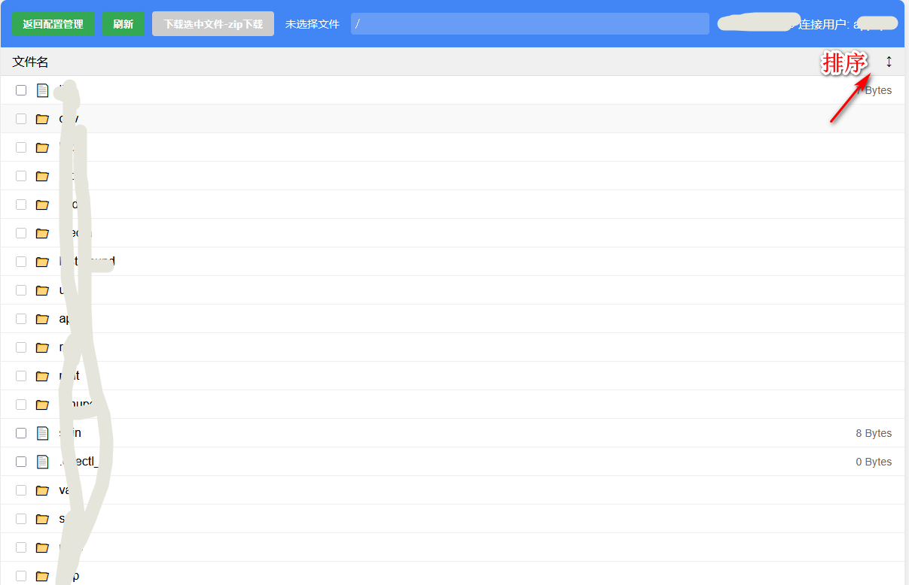
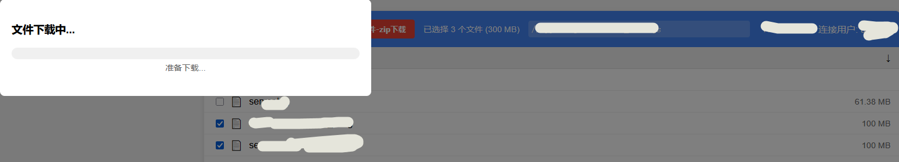

# FilesBrowser
    Remote Server File Browsing and Download Tool（远程服务器文件下载）
    下载文件格式：zip, 下载目录在window的C:\Users\Administrator\Downloads\

## 部署
### window环境     （IIS安装）
        1、需要在web.config中替换PYTHONPATH 和 scriptProcessor
    
    <?xml version="1.0" encoding="UTF-8"?>
    <configuration>
    <system.webServer>
        <handlers>
        <!-- scriptProcessor 的值来自命令行工具 wfastcgi-enable -->
        <add name="FlaskFastCGI" path="*" verb="*" modules="FastCgiModule" scriptProcessor="D:\Document\Document\apps\sshdFtpEnv\Scripts\python.exe|D:\Document\Document\apps\sshdFtpEnv\lib\site-packages\wfastcgi.py" resourceType="Unspecified" requireAccess="Script" />
        </handlers>
        <security> 
            <!-- URL 重写中的特殊字符，比如加号+等等 -->
            <requestFiltering allowDoubleEscaping="true"></requestFiltering> 
        </security> 
    </system.webServer>
    
    <appSettings>
        <!-- Required settings -->
        <!-- 在这里指定Falsk app在模块中的具体位置 -->
        <add key="WSGI_HANDLER" value="run.app" />
        <!--<add key="PYTHONPATH" value="D:\Document\Document\apps\sshdFtpEnv\" />-->

        <!-- Optional settings -->
        <!-- 需要先创建日志目录，否则报错 -->
        <add key="WSGI_LOG" value="D:\Document\Document\apps\sshdFtpEnv\logs\oboeqa_web.log" />
            <add key="PYTHONPATH" value="D:\Document\Document\apps\sshdFtpEnv" />
		    
    </appSettings>
    </configuration>

# 效果图
### 1、配置

### 2、进入文件浏览界面

### 3、文件下载界面

